<div align="center">



<br/>

[](https://www.linkedin.com/in/aky9821/)
[](https://x.com/Aky_9821)
[](mailto:akshay.nagar0101@gmail.com)


</div>

### `$ cat about.md   # about me`

Founding engineer at **[Reacher](https://www.reacherapp.com)**, the affiliate platform TikTok Shop brands use to find, message and manage creators on autopilot.
Most of my work is the data layer: the ClickHouse analytics stack, the production Postgres underneath it, the pipelines that pull TikTok Shop data in, and the pager when any of it breaks.
The rest of the time I build tooling that lets a small team ship like a large one.

### `$ git log --highlights   # what I've shipped`

#### ⚡ Postgres ➜ ClickHouse

Moved the product's analytics reads from Postgres onto ClickHouse with a staged, flag-gated rollout. A strict parity harness had to match prod before anything switched over, and once it did, I deleted the old read paths.

- Worst-case dashboard loads got **an order of magnitude faster**: what used to take tens of seconds now comes back in a second or two.
- Heavy CRM recomputes that ran for most of a minute now **finish in seconds**.
- Matched prod on **every request** before cutover.

#### 🐘 Postgres in production

- **Led our production Postgres migration** to a new managed provider. Logical replication kept the new copy in sync until cutover, new connection pooling went in front of it, and the switch happened inside one short planned maintenance window.
- Query tuning on the hot paths. Some searches went from **tens of seconds to well under a second** with the right indexes and caching, and an auth cache took a big chunk of DB work off every dashboard load.
- Safe-by-default prod access, for engineers and for AI agents.

#### 🛰️ Pipelines & on-call

- TikTok Shop data pipelines, real-time and batch, feeding the analytics layer.
- Observability for the whole pipeline graph: lineage, freshness, and alerts that fire on state instead of noise.
- First responder on production incidents. I find the cause, ship the fix, write the blameless postmortem, and then add the guard that stops it from happening again.

#### 🤖 Agentic engineering

- **Claude Code and OpenAI Codex, side by side.** Claude does most of the driving. Codex runs read-only as an adversarial reviewer that tries to break each diff, and because it's a different model family it catches bugs Claude's own review misses.
- A personal Claude Code harness:
  - hooks that block destructive SQL against prod
  - a commit gate that audits comments first
  - auto-backgrounding for long commands
  - per-session state piped into my tmux sidebar
- A looping review agent that reads every PR requested from me and leaves inline comments. It never approves.
- Contributor to Reacher's shared AI dev tooling: agents, skills and guardrails that every repo picks up.
- On a normal day I have about **20 Claude Code sessions** running in parallel, each in its own git worktree, with Codex sessions alongside them.

### `$ cat stack.toml   # tech I use`

| | |
| :-- | :-- |
| `lang` |      |
| `data` |      |
| `backend` |    |
| `frontend` |      |
| `infra` |     |
| `ai` |     |
| `desk` |     |

### `$ tmux attach   # my workspace`



- **The machine:** ASUS ROG Strix G15 with a Ryzen 9 5900HX, 40 GB of RAM, an RTX 3050 Ti plus a Radeon iGPU, running Ubuntu 24.04. It's my dev box and also the homelab server.
- **Keys:** tmux with Zellij-style modal bindings. `Alt-hjkl` moves between panes; `Ctrl-p`, `Ctrl-t`, `Ctrl-n` and `Ctrl-s` switch to the pane, tab, resize and scroll modes.
- **The dock:** an outer tmux server wraps the real session. Its clickable sidebar lists every Claude session by status (working, needs you, idle) and shows widgets for Slack and Linear focus, open PRs, my next meeting, now playing, weather, CPU and network.
- **The rest:** gruvbox everywhere, resurrect and continuum so sessions survive reboots, `lazygit`, `btop`, and an ASCII cat that panics when CPU goes over 70%.

### `$ docker ps   # homelab`

```text
jellyfin      movies & tv
navidrome     music streaming (subsonic api)
sonarr        tv library automation
radarr        movie library automation
slskd         soulseek -> beets (musicbrainz match) -> navidrome
wolf          games-on-whales: streams games from the iGPU to any moonlight client
```

An earlier version of the music setup is public as [**soularr-stack**](https://github.com/Aky9821/soularr-stack), and the old [**neoted**](https://github.com/Aky9821/neoted) is a terminal text editor I wrote in C++.

### `$ cat ~/.fun   # off the clock`

```text
🥦  vegetarian, and serious about fitness
🎸  learning electric guitar — slowly, loudly
🐈  the cat in my tmux sidebar has better uptime than most services
```

<div align="center">

<sub>Happy to talk ClickHouse, Postgres migrations, data pipelines, or agent tooling: <a href="mailto:akshay.nagar0101@gmail.com">akshay.nagar0101@gmail.com</a></sub>

</div>
